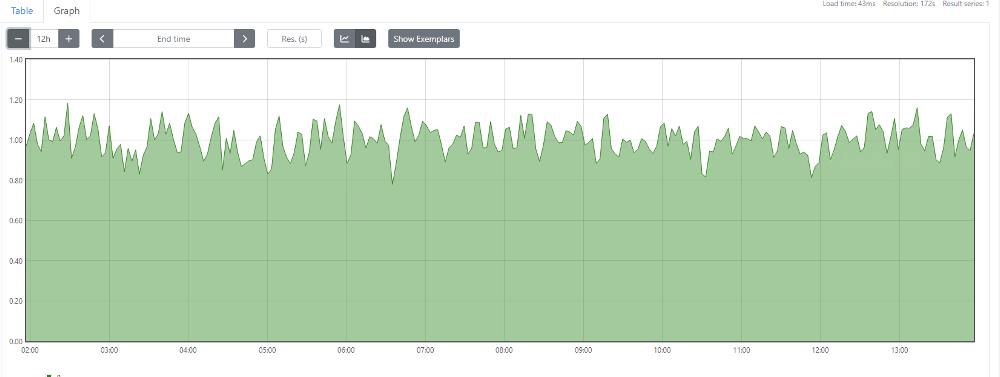
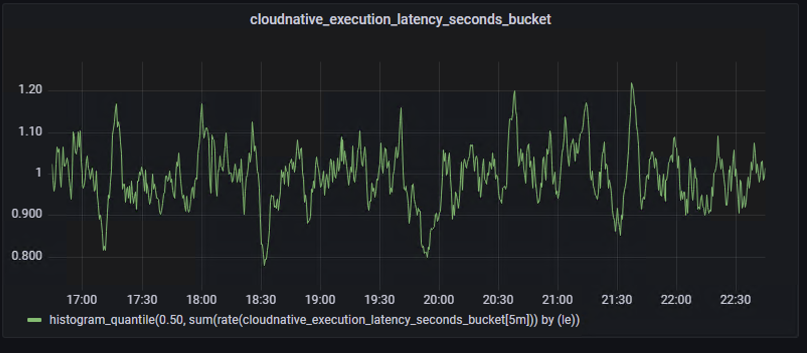

## 作业
- 为 HTTPServer 添加 0-2 秒的随机延时；  https://github.com/PoplarYang/cncamp/tree/main/module2/simpleHttpServer
- 为 HTTPServer 项目添加延时 Metric；   https://github.com/PoplarYang/cncamp/tree/main/module2/simpleHttpServer
- 将 HTTPServer 部署至测试集群，并完成 Prometheus 配置；

- 从 Promethus 界面中查询延时指标数据；

- （可选）创建一个 Grafana Dashboard 展现延时分配情况。


## install prometheus
```bash
$ helm repo add prometheus-community https://prometheus-community.github.io/helm-charts
helm repo update

$ kubectl create ns prometheus-stack

$ helm -n prometheus-stack install  kube-prometheus-stack prometheus-community/kube-prometheus-stack
```

## 通过service自动发现target
Service 的 annotation 区域添加  prometheus.io/scrape=true  的声明
```bash
kubectl create secret generic additional-configs --from-file=prometheus-additional.yaml -n  prometheus-stack
```
添加抓取的配置
```bash
kubectl get prometheuses -n prometheus-stack -oyaml

  spec:
    additionalScrapeConfigs:
      key: prometheus-additional.yaml
      name: additional-configs
```
TODO: update
重启下prometheus pod，通过delete pod进行重启。prometheus 支持热加载，这里怎么用待更新

## 创建rbac
```bash
kubectl create -f rbac.yaml
```

## 在httpserver的的service上增加annotation
这样才能被自动发现
```yaml
metadata:
  annotations:
    prometheus.io/port: "8080"
    prometheus.io/scrape: "true"
```

## 查看Prometheus原生监控图
```bash
kubectl port-forward -n prometheus-stack  --address 0.0.0.0 svc/kube-prometheus-stack-prometheus 9090:9090
```
```
histogram_quantile(0.50, sum(rate(cloudnative_execution_latency_seconds_bucket[5m])) by (le))
```


## grafana
查看密码
```bash
kubectl get secret -n prometheus-stack kube-prometheus-stack-grafana -o yaml

echo YWRtaW4= | base64 --decode
admin

echo cHJvbS1vcGVyYXRvcg== | base64 --decode
prom-operator
```

port forward 到本地
```bash
kubectl port-forward -n prometheus-stack  --address 0.0.0.0 svc/kube-prometheus-stack-grafana 9000:80
```


